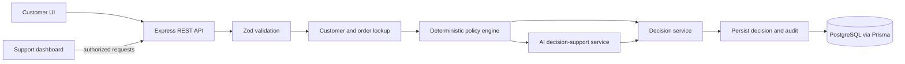

# AI-Powered Customer Support Refund System

A full-stack assessment project for reviewing e-commerce refund requests. The system is designed to combine deterministic refund rules with AI-supported interpretation and customer-friendly explanations. The AI is a decision-support component; deterministic policy rules remain authoritative.

## Project status

This repository currently contains the initial React/Vite and Express/Prisma scaffolding. The implementation is intended to proceed in small reviewable subtasks:

1. Establish the project foundation, architecture, and local configuration (current step).
2. Define the database schema, migrations, and synthetic customer/order seed data.
3. Implement deterministic policy evaluation and the isolated structured AI provider.
4. Implement refund orchestration, decision rules, persistence, and audit records.
5. Add validated customer and authorized support API endpoints.
6. Build the customer request experience and internal support dashboard.
7. Add focused automated tests and complete container/setup documentation.

## Planned architecture



The backend will keep API routing, policy evaluation, AI integration, final decision-making, and persistence/auditing in separate modules. The policy engine will produce explicit rule results. The decision service will enforce hard policy outcomes even if AI output is malformed, unavailable, or suggests an unsupported action. The AI provider will use structured inputs and validated structured output; customer-authored text will be treated as untrusted data.

## Planned technology

- **Frontend:** React, TypeScript, Vite, Tailwind CSS, React Router, TanStack Query
- **Backend:** Node.js, TypeScript, Express, Zod
- **Database:** PostgreSQL, Prisma
- **AI:** OpenAI API behind a small provider abstraction, with a safe no-provider/failure path
- **Infrastructure:** Docker Compose
- **Testing:** Vitest, Supertest, and React Testing Library where useful

## Planned folder structure

```text
backend/
  prisma/       Prisma schema, migrations, and seed data
  src/
    routes/     HTTP endpoints and validation
    services/   Policy, decisions, AI provider, and audit logic
    index.ts    Application entry point
frontend/
  src/          Customer and support experiences
docker-compose.yml
.env.example
README.md
```

## Environment variables

Copy `.env.example` to `.env` for local Docker Compose use. Keep real credentials in `.env`; never commit them. Compose has a clearly named local-only fallback for the support API key so the stack can be inspected and started without extra setup; replace it with a private value before use and never use that fallback outside local development.

| Variable | Purpose | Local default |
| --- | --- | --- |
| `POSTGRES_USER` | PostgreSQL user | `postgres` |
| `POSTGRES_PASSWORD` | PostgreSQL password | `postgres` |
| `POSTGRES_DB` | PostgreSQL database | `refund_db` |
| `DATABASE_URL` | Backend Prisma connection string | Points to the Compose `postgres` service |
| `PORT` | Backend listen port | `3001` |
| `NODE_ENV` | Backend runtime mode | `development` locally; Compose uses `production` |
| `ADMIN_API_KEY` | Secret for protected support endpoints | Set a private local value; no default is provided by Compose |
| `OPENAI_API_KEY` | Optional AI provider credential | Empty means use the safe unavailable-provider path |
| `OPENAI_MODEL` | OpenAI model name | `gpt-4o-mini` |

## Local development

Install dependencies at the repository root, then run the frontend and backend together:

```sh
npm install
npm run dev
```

The Vite development server proxies `/api` to `http://localhost:3001`. Database-backed development requires PostgreSQL and a matching `DATABASE_URL` in the environment.

## Docker setup

After copying and editing the environment file, start the stack with:

```sh
docker compose up --build
```

The planned local URLs are `http://localhost:3000` for the frontend and `http://localhost:3001/api/health` for backend health. PostgreSQL is exposed on port `5432`. Database initialization and seeding will be documented with the database implementation step.

## Database and seed data

The planned Prisma models cover customers, orders, order items, refund requests, and audit records. Seed data will be synthetic and will cover normal, expired, final-sale, damaged, incorrect-item, high-value, and conflicting-request examples. Schema, migration, and seeding commands will be finalized when those pieces are implemented.

## Refund decision flow

```text
Validate request -> retrieve customer/order -> evaluate deterministic rules
  -> obtain validated AI support (or record provider failure)
  -> enforce final decision rules -> persist request and audit -> return safe response
```

Final-sale restrictions, refund-window expiry, high-value human review, and missing/unverifiable order information will be enforced deterministically. Damaged or incorrect items can qualify under policy. Suspicious or conflicting information will be escalated. The LLM cannot grant an exception to a hard rule or choose an arbitrary final decision.

## Security considerations

- Validate and bound every externally supplied field, including customer messages and identifiers.
- Treat customer text as untrusted data and keep it separate from trusted system instructions and policy context.
- Validate the AI response against a strict schema and ignore unsupported decision directives.
- Fall back safely when the provider fails; never turn an AI error into approval.
- Protect support/admin endpoints with server-side authorization and keep credentials out of source control.
- Return customer-safe explanations separately from internal AI and audit details.

These controls are planned and will be implemented alongside the related API and decision-flow subtasks.

## Planned API

| Method | Endpoint | Purpose |
| --- | --- | --- |
| `GET` | `/api/health` | Service health |
| `POST` | `/api/refunds` | Submit a refund request |
| `GET` | `/api/refunds` | List requests for authorized support users |
| `GET` | `/api/refunds/:id` | Inspect a request and its support audit |
| `GET` | `/api/customers/:id` | Retrieve a customer record |
| `GET` | `/api/orders/:id` | Retrieve an order record |

Support endpoints will require authorization. Customer responses will not include internal audit information.

## Testing

The workspaces provide build and test scripts. Focused policy, decision, validation, and API tests will be added with the behavior they cover. Run the eventual suite from the repository root with:

```sh
npm test
npm run build
```

## Assumptions and trade-offs

- The application is an interview demonstration, not a payment processor; approving a request records a decision and does not issue funds.
- A simple shared API key is sufficient for the assessment's support endpoints; a production deployment should use an identity provider, role-based access, and key rotation.
- The AI produces structured interpretation and explanation, while deterministic application code owns eligibility and final decisions.
- PostgreSQL is the source of truth for request and audit history.
- Local Compose credentials are for development only and must be replaced outside local use.

## Future improvements

- Replace the demonstration admin key with SSO and role-based authorization.
- Add idempotency keys, rate limits, structured operational metrics, and tracing.
- Add configurable policy versioning and human-review workflow actions.
- Add evidence uploads and integrations with commerce and payment providers.
- Add retention controls and privacy tooling for customer data and AI payloads.
# AI-Refund-Support-System

